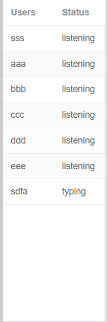
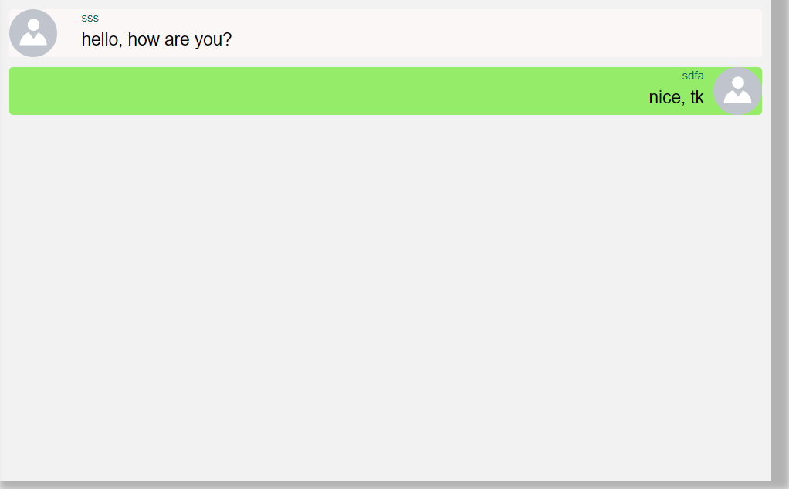
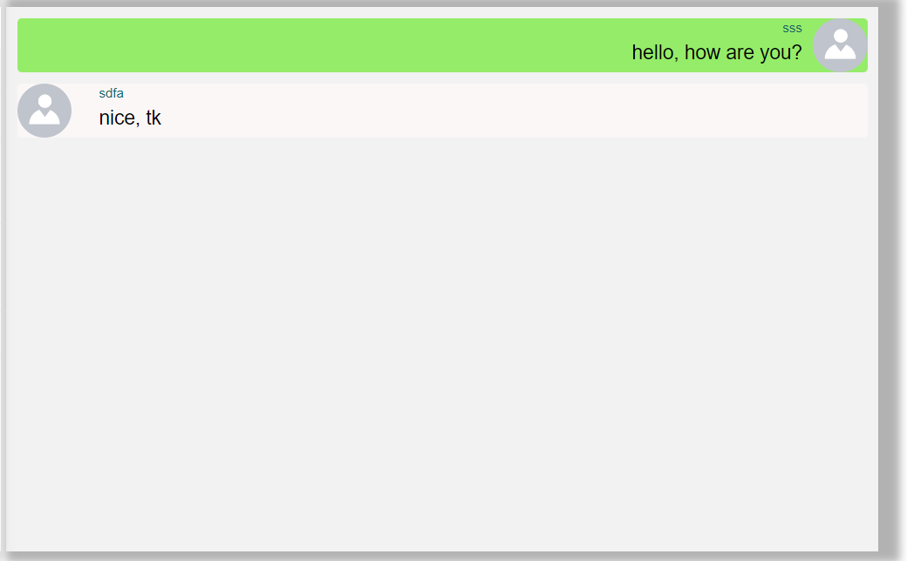
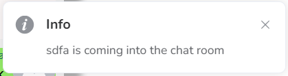

# Report of the Chat Room

## Introduction


This project include two parts, client part and server part. I use Vue.js framework and bootstrap framework to design the client part, and using socketIo to connect the client and server.

## Basic design


### client

The client part include three pages, which are home page, about page and chat room page. To just view the client side, go into the file and run command

```js
npm install
npm run serve
```

#### Home page

The home page use bootstrap framework and I put a picture as background. The page have two buttons, they will lead the user to about page or chat room page. At the bottom of the background picture, there is my basic information, including my name, ID and my major.

#### About page

The about page has more detail information about me. It tells my hobby besides software engineering, which is CTF challenges. After the basic introduction of the CTF, I also provide my blog and my github, where you can find my study notes and project, by the way, the blog is made on my own. Last, I show my hobby when I am free, which is reading and doing sport. 

#### Chat room 

The chat room have a user list, which can show all the user in chat room, beside the user, there is a status windows. It can show the user's status, like listening and typing. Beside the list is the chat window, what users submit will show on the windows of all users. This message can be seen by all the users who connect to the chat room. When user send the message, the chat window will show the message in different color in order to distinguish each user's messages.

### server

The server side I use socketIO to connect the client side and handle the event. All the event will be handled here. To install the needed module, run:

```
npm install
```

To run the server, run:

```js
npm start
```

Since the static pages are in the public directory, so running the server then the pages will be seen in the port 3030.

## how the chat application client side communicates with the server

### userList

Because of the Vue.js framework is different from the original html and css, so I need to install socketIO-client module. When the user visit the chat room page, after the page mounted, a socket object is created and start communicating with the server. When user come to the chat room, the web will give each user a id called "uuid", each user's "uuid" is different, this is because I allow users have the same user name. After deciding the user name and gain the "uuid", the client side will send the data to server side, and the server will store the data  as "userInfo", the "userInfo" have all the user's information connect to the server. After receiving the user information from client side, the server side will send message to all the users in chat room. This event can let all the users have the information of the other users. And this is the key that show all the users in chat room. 



### history message & submit message

When user come into the chat room, the chat room will load all the history message.  And I use function socket.emit() to send the history message to the user who are the new to the chat room. When user send the message, the message will be sent to server side, and the server will handle this message, each message will match user's name and "uuid", after handling the event, the server will send the message back to the each client, and the Vue.js framework will get the message and load the message into the chat window.





### notification

When a user come into the chat room, the server receive the data and tell all the users in chat room. The client side will receive the notification and show on the page. The notification module is used from element-ui, the same method when a user leave the chat room.




### typing status

When user is typing in the input place, before sending the message, the client side will listen the input place, if there are words in the input place, the client will send message to server and receive status and load on the status window.


### core code

server side:

```js
  socket.on('submitMsg',(req,callback)=>{
    allMessage.push(req)
    console.log(allMessage)
    io.emit('allMessage',allMessage)
    callback(allMessage)
  })
```

client side:

```vue
async submitMsg(msg) {
    const socket=this.socket

    var data = {
        account: this.$route.query.account,
        uuid: this.$route.query.uuid,
        message: msg
    };
    console.log('data=>',data)
    const result = await new Promise((resolve) => {
        socket.emit('submitMsg', data, (res) => {
            resolve(res)
        })
    });
    this.message = result
    console.log(this.message)

},
```


## the challenges faced during the development of the website

### Synchronous and asynchronous

When designing client side, the client send a message to server, the server should send back the message to all the user. But in this stage, if the client does not receive the message from server, and the code process is faster than the server sending message. It will come to a situation that the client side finish loading the data but the data is still in the server side, so the client page have no data at all. To handle this problem, I use async/await function to let the code process wait for the data from server, and at this time, the process "wait" for the message and do not load the data on pages until the data were sent to client side. Besides, I use callback function handle the event, the example code is as follow:

```js
const result = await new Promise((resolve) => {
    socket.emit('accountAndUuid', [this.$route.query.account, this.$route.query.uuid], (data) => {
        resolve(data)
    })
})
console.log('result=>', result)
```

### Match each user with unique ID

Because of the user name can be the same, so how to identify each user is a problem. I use a module called "uuid", it can create a unique ID when a user come into the chat room. So the server can identify the user by "uuid" instead of user name.

## References to the sources

bootstrap: <https://www.bootcss.com/>

Vue.js: <https://cn.vuejs.org/>

socketIO: <https://socket.io/>
